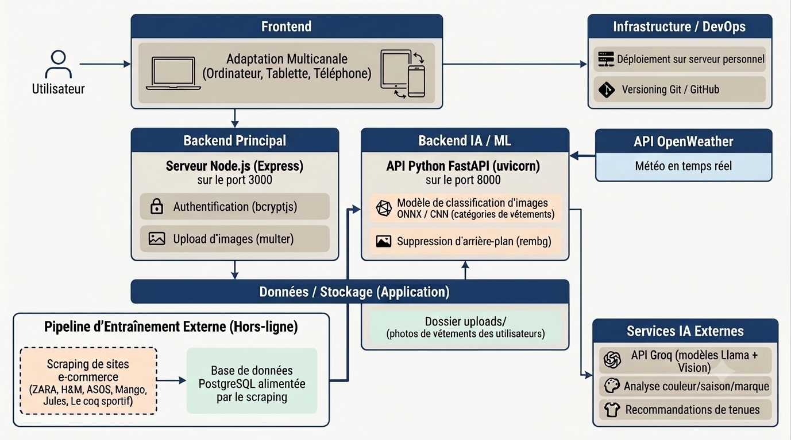
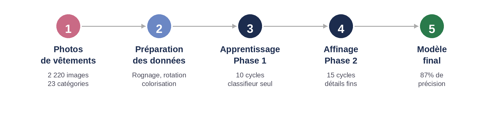
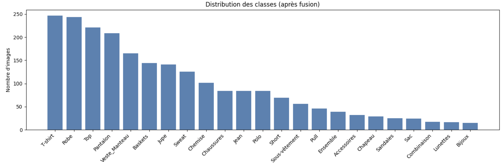
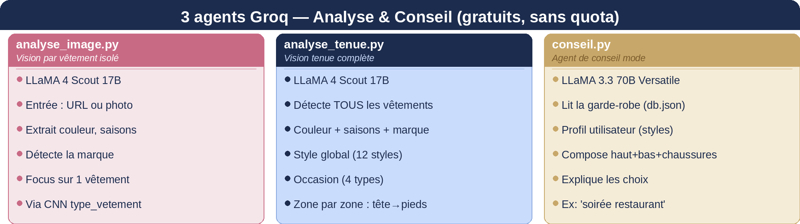

# SmartWear — Dressing Intelligent avec IA

> **S'habiller avec intelligence**  
> Projet d'étude · Mastère 2 Big Data & Intelligence Artificielle · Sup de Vinci  
> Solenn COULON & Coline TREILLE · Octobre 2025 – Juin 2026

---

## Lancer le projet

> Branche à utiliser : `solenn`

```bash
git clone -b solenn https://github.com/Solenn-C/Projet_d_etude.git
cd Projet_d_etude
```

**Variables d'environnement**
Copier `.env.example` en `.env` et renseigner :
- `GROQ_API_KEY` → clé gratuite sur [console.groq.com](https://console.groq.com)

**Dépendances**
```bash
# Node.js
npm install

# Python (Windows)
py -m pip install -r Backend/requirements.txt

# Python (Mac/Linux)
python3 -m pip install -r Backend/requirements.txt
```

**Lancement — dans cet ordre**
```bash
# 1. FastAPI (port 8000) — depuis Backend/
py -m uvicorn main:app --reload --port 8000

# 2. Node.js (port 3000) — depuis la racine
node server.js
```

Ouvrir → http://localhost:3000

---

## Table des matières

1. [Présentation du projet](#1-présentation-du-projet)
2. [Équipe & rôles](#2-équipe--rôles)
3. [Architecture technique](#3-architecture-technique)
4. [Stack & dépendances](#4-stack--dépendances)
5. [Installation & lancement](#5-installation--lancement)
6. [Fonctionnalités](#6-fonctionnalités)
7. [Modèle IA — CNN MobileNetV2](#7-modèle-ia--cnn-mobilenetv2)
8. [Agents IA Groq](#8-agents-ia-groq)
9. [API Météo & recommandations](#9-api-météo--recommandations)
10. [Tableau de bord & KPIs](#10-tableau-de-bord--kpis)
11. [Scraping & collecte de données](#11-scraping--collecte-de-données)
12. [Gestion de projet](#12-gestion-de-projet)
13. [Budget](#13-budget)
14. [Difficultés rencontrées](#14-difficultés-rencontrées)
15. [Axes d'amélioration](#15-axes-damélioration)
16. [Liens utiles](#16-liens-utiles)

---

## 1. Présentation du projet

**SmartWear** est une application web full-stack de gestion de garde-robe intelligente. Elle combine vision par ordinateur, agents IA conversationnels et données météo en temps réel pour proposer des recommandations de tenues personnalisées.

### Objectifs SMART

| Lettre | Objectif |
|--------|----------|
| **S** | Système d'analyse de garde-robe intelligent |
| **M** | Recommandations personnalisées à 100 % |
| **A** | Adapté à 3 profils utilisateurs distincts |
| **R** | Intégration météo & tendances mode |
| **T** | Livraison complète du projet en 4 mois |

### Analyse SWOT

| | Forces | Faiblesses |
|---|---|---|
| **Internes** | IA personnalisée, architecture modulaire | Données limitées, équipe réduite (binôme) |

| | Opportunités | Menaces |
|---|---|---|
| **Externes** | Marché mode connectée en croissance | Scraping bloqué par les anti-bots, concurrence |

---

## 2. Équipe & rôles

| Membre | Rôle | Responsabilités |
|--------|------|-----------------|
| **Solenn COULON** | Développeur Fullstack | Architecture frontend, développement du site, intégration API météo, restructuration Git, tests & déploiement | Scrum master | 
| **Coline TREILLE** | Data & Modèle IA | Scraping multi-marques, modèle CNN image, Docker & containerisation, documentation technique, agents IA | Scrum master | 

---

## 3. Architecture technique



---

## 4. Stack & dépendances

### Frontend
- HTML5 / CSS3 / JavaScript vanilla
- Design system : Navy · Crème · Terracotta · Sage-green
- Typographies : DM Serif Display + Jost
- Responsive mobile-first (320 px → 1440 px+)

### Backend Node.js (port 3000)
| Package | Usage |
|---------|-------|
| `express` | Serveur HTTP |
| `bcryptjs` | Hashage des mots de passe |
| `multer` | Upload de fichiers |
| `node-fetch` | Appels API externes |
| `dotenv` | Variables d'environnement |

### Backend Python FastAPI (port 8000)
| Package | Usage |
|---------|-------|
| `fastapi` + `uvicorn` | Serveur ASGI |
| `onnxruntime` | Inférence du modèle CNN |
| `rembg` | Suppression d'arrière-plan |
| `Pillow` | Traitement d'images |
| `groq` | API Groq (agents IA) |

### IA / ML
| Technologie | Usage |
|-------------|-------|
| MobileNetV2 (Transfer Learning) | Base du CNN |
| ONNX (`fashion_classifier.onnx`) | Déploiement du modèle |
| Groq — LLaMA 4 Scout 17B | Vision vêtement & tenue |
| Groq — LLaMA 3.3 70B Versatile | Agent conseil mode |

### Données & infra
- **OpenWeather API** — météo temps réel
- **PostgreSQL** — base d'entraînement (hors-ligne, pipeline scraping)
- **Docker / docker-compose** — containerisation
- **GitHub** — versioning ([Projet_d_etude](https://github.com/Solenn-C/Projet_d_etude))
- **Linear** — gestion de projet agile

---

## 5. Installation & lancement

### Prérequis
- Node.js ≥ 18
- Python ≥ 3.10 (Windows : utiliser `py -m`)
- Docker (optionnel)

### Variables d'environnement

Créer un fichier `.env` à la racine :

```env
GROQ_API_KEY=your_groq_key_here
OPENWEATHER_API_KEY=your_openweather_key_here
```

> ⚠️ Ne jamais committer ce fichier. Vérifier `.gitignore`.

### Lancement manuel (ordre impératif)

**1. Backend Python (FastAPI) — à démarrer EN PREMIER**

```bash
py -m uvicorn main:app --reload --port 8000
```

**2. Backend Node.js**

```bash
node server.js
```

L'application est accessible sur `http://localhost:3000`.

### Lancement via Docker

```bash
docker-compose up --build
```

---

## 6. Fonctionnalités

| Fonctionnalité | Description |
|----------------|-------------|
| **Authentification** | Inscription / connexion sécurisée avec bcrypt ; `userId` dérivé côté serveur depuis la session |
| **Gestion de garde-robe** | Ajout, modification, suppression de vêtements avec photo |
| **Suppression de fond** | `rembg` appliqué automatiquement à chaque photo uploadée |
| **Classification ONNX** | Top-3 de catégories proposé à l'utilisateur pour confirmation (23 classes) |
| **Analyse vêtement isolé** | Agent vision : couleur, saison, marque, type |
| **Analyse tenue complète** | Agent vision : détection zone par zone (tête → pieds), style global, occasion |
| **Agent conseil tenue** | Suggestions haut + bas + chaussures selon profil, occasion et météo |
| **Chatbot mode** | Conversation libre avec l'IA sur les tenues et tendances |
| **Météo intégrée** | Widget météo temps réel (OpenWeather), prévisions heure par heure |
| **Tableau de bord & KPIs** | Statistiques complètes de la garde-robe (voir section dédiée) |
| **Génération annonce Vinted** | Création automatique de descriptions de revente |

---

## 7. Modèle IA — CNN MobileNetV2

### Pipeline d'entraînement




### Dataset

- **33 classes initiales** issues du scraping
- Règle de fusion : classes < 15 images → fusionnées dans leur classe parente
- **23 classes finales**, 2 217 images totales
- Split stratifié 80/20 : 1 773 images train / 444 images validation
- Entraînement sur GPU Google Colab (~1h)

### Distribution des classes finales



### Déploiement

Le modèle est exporté au format **ONNX** (`model/fashion_classifier.onnx`) et servi via FastAPI (`scripts/predict.py`). Cette séparation CNN / inférence ONNX est un choix architectural délibéré : le modèle de Coline est interchangeable sans toucher au backend Node.js.

---

## 8. Agents IA Groq

Trois agents indépendants, tous via l'API Groq (gratuite, sans quota fixe) :



### Occasions reconnues

| Occasion | Contextes |
|----------|-----------|
| Vie quotidienne | courses, balades, journée décontractée |
| Professionnel | bureau, réunions, smart casual |
| Sport & loisirs | activités sportives, sorties détente |
| Soirée & événement | dîner, soirée, occasion habillée |

### 12 styles reconnus

`Casual chic · Minimaliste · Classique · Streetwear · Bohème · Romantique · Élégant · Sportswear · Vintage · Smart casual · Preppy · Avant-garde`

> **Note :** Un script `classify_style.py` initial utilisait Claude Haiku (~0,25 USD/1 000 produits) pour attribuer un style à chaque produit scraped. Ce script a été arrêté (trop coûteux à l'échelle) et remplacé par les agents Groq.

---

## 9. API Météo & recommandations

- **Source** : OpenWeather API (plan gratuit)
- **Données** : température, ressenti, min/max, humidité, vent, probabilité de pluie, prévisions heure par heure
- **Sécurité** : la clé API est appelée exclusivement côté serveur Node.js — jamais exposée au navigateur
- **Localisation** : basée sur la position de l'utilisateur (Paris par défaut)
- **Finalité** : les conditions météo du jour alimentent directement le moteur de recommandation IA (`conseil.py`)

---

## 10. Tableau de bord & KPIs

Le dashboard agrège quatre familles d'indicateurs :

| Famille | KPIs |
|---------|------|
| **Inventaire** | Volume total, répartition par catégorie, couleurs dominantes, répartition par saison |
| **Usage** | Taux de port, pièces dormantes (jamais portées), vêtement star de la semaine/saison |
| **Valeur** | Coût par port estimé, potentiel de revente Vinted |
| **Recommandations** | Taux d'adoption des suggestions IA, tenues proposées par météo |

> Chaque indicateur guide une action concrète : port, tri ou revente.

---

## 11. Scraping & collecte de données

### Sites ciblés

`H&M · ASOS · Zara · Jules · Mango · Le Coq Sportif`

### Données collectées par produit

nom · prix · description · genre · catégorie · style · tailles disponibles · couleurs disponibles · image

### Pipeline technique

```
Scrapers (6 marques)  →  Pipeline multiprocessing  →  PostgreSQL + déduplication  →  Reclassification  →  Dataset 23 classes
```

- Contournement anti-bot : rotation des user-agents & délais adaptatifs
- **2 196 produits** collectés, **2 181 classifiés** avec un style_mode (les 15 restants sont hors-mode : parfums, etc.)

---

## 12. Gestion de projet

### Méthodologie

Méthode **Agile** avec sprints itératifs de 3 semaines. Backlog géré dans **Linear** (projet "Mode & Météo — SmartWear", identifiant équipe `Projet_etude_SmartWear`).

### Backlog

**PRO-1 → PRO-32** — 28 issues réparties en 3 jalons (milestones) :

| Milestone | Contenu |
|-----------|---------|
| **M1 — Catalogue & scraping** | 6 scrapers, pipeline multiprocessing, PostgreSQL, dataset 23 classes |
| **M2 — Infrastructure & site** | Site web, Git, API météo, Docker, tests & déploiement |
| **M3 — IA, vision & recommandations** | CNN ONNX, agents vision, agent conseil, chatbot, intégrations FastAPI |

### Sprints (5 cycles de 3 semaines)

| Sprint | Période | Focus principal |
|--------|---------|-----------------|
| S1 | 10 – 28 mars 2026 | Fondations : scraping & infrastructure site |
| S2 | 31 mars – 18 avr. 2026 | Intelligence : CNN, classification styles, auth, upload |
| S3 | 21 avr. – 9 mai 2026 | Intégration IA : agents vision, chatbot, ONNX FastAPI |
| S4 | 12 – 30 mai 2026 | Finalisation : endpoints analyse, affichage tenues, Docker |
| S5 | 2 –  19 juin 2026 | Livraison : dossier technique, préparation soutenance |

### Diagramme de Gantt (résumé)

[Voir le Gantt interactif](https://htmlpreview.github.io/?https://github.com/Solenn-C/Projet_d_etude/blob/main/gantt_smartwear_2.html)

### Suivi

- Revues de sprint hebdomadaires
- Issues Linear avec sprint cible inscrit dans le champ description
- Versioning GitHub avec branches feature

---

## 13. Budget

### Coûts directs

| Poste | Unitaire | Quantité | Total |
|-------|----------|----------|-------|
| Abonnement Claude Pro — Solenn | 23,66 €/mois | 4 mois | 94,94 € |
| Abonnement Claude Pro — Coline | 23,66 €/mois | 4 mois | 94,94 € |
| API Claude (tests, arrêtée) | forfait | — | 5,00 € |
| API OpenWeather | gratuit | — | 0,00 € |
| Hébergement (serveur personnel) | gratuit | — | 0,00 € |
| API Groq | gratuit | — | 0,00 € |
| **TOTAL COÛTS DIRECTS** | | | **194,28 €** |

### Coûts ressources humaines

| Ressource | Heures | Taux | Total |
|-----------|--------|------|-------|
| Solenn COULON (Dev Web) | ~80 h | 25 €/h | 2 000 € |
| Coline TREILLE (Data & IA) | ~80 h | 25 €/h | 2 000 € |
| **TOTAL RH** | **~160 h** | | **4 000 €** |

### Coût total du projet

| Poste | Montant |
|-------|---------|
| Coûts directs | 194,28 € |
| Coûts RH | 4 000,00 € |
| **COÛT TOTAL** | **4 194,28 €** |

---

## 14. Difficultés rencontrées

| Problème | Solution apportée |
|----------|-------------------|
| Scraping H&M / ASOS bloqué (protection anti-bot) | Rotation des user-agents & délais adaptatifs entre requêtes |
| Agent conseil : noms renvoyés par l'IA ≠ noms exacts en base | Matching normalisé insensible à la casse et aux accents |
| Coût de `classify_style.py` (Claude Haiku ~0,25 USD/1 000 produits) | Remplacement par agents Groq gratuits |
| Clés API Groq exposées dans un commit public (`43bc03a`) | Révocation immédiate sur console.groq.com + rotation des clés |
| Contraintes temps & ressources (4 mois, binôme) | Repriorisation agile du backlog, focus sur le MVP fonctionnel |
| Rate limit Groq (~118 appels/24h sur plan gratuit) | Gestion des erreurs 502 côté serveur, retry UX |

---

## 15. Axes d'amélioration

- **Notifications météo intelligentes** — alertes proactives basées sur les prévisions du lendemain
- **Modèle zone (multi-vêtements)** — reconnaissance simultanée de plusieurs pièces dans une photo de tenue
- **Modèle tendances** — intégration des données scraping pour aligner les recommandations sur les collections actuelles
- **Passage au produit déployable** — évoluer de prototype académique vers application réellement exploitable (BDD relationnelle, CI/CD, tests automatisés)
- **Dimension éco-responsable** — valoriser la garde-robe existante, inciter à recomposer plutôt qu'acheter, faciliter la revente Vinted

---

## 16. Liens utiles

| Ressource | Lien |
|-----------|------|
| Repository GitHub | https://github.com/Solenn-C/Projet_d_etude |
| Backlog Linear | Projet "Mode & Météo — SmartWear" |
| Documentation OpenWeather | https://openweathermap.org/api |
| Documentation Groq | https://console.groq.com/docs |

---

*SmartWear — Mastère 2 Big Data & IA · Sup de Vinci · Juin 2026*  
*Solenn COULON & Coline TREILLE*
